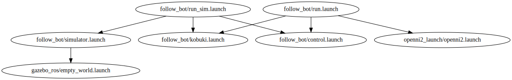

# launch-graph

[](https://travis-ci.com/mdepp/launch-graph)

This is a utility I wrote to visualize include dependencies for [ROS](https://wiki.ros.org/) launch files.

To set it up, clone this repository, navigate to the directory containing this Readme, and type
```bash
echo "export PATH=$PATH:$(pwd)/bin" >> ~/.bashrc
```
to add the utility's script to the path (you will then need to open a new terminal or re-source bashrc with `source ~/.bashrc`).

To use the utility, navigate to your ROS workspace directory, and type
```bash
launch-graph
```
which will analyze launch files from all packages in the workspace and output its results to `launch-files.gv` and `launch-files.gv.svg`.


Here's an example I generated from a project I wrote for a class:

